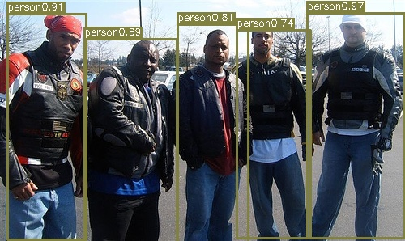

# Creator_tool代码解释
## ProposalTargetCreator
它的主要功能是将给定的RoIs（Region of Interest）分配给truth的边界框

在__init__方法中定义了一些参数，包括采样区域的数量（n_sample）、被标记为foreground的区域的比例（pos_ratio）、被认为是foreground的RoI的IoU阈值（pos_iou_thresh）、被认为是background的RoI的IoU阈值上限（neg_iou_thresh_hi）和下限（neg_iou_thresh_lo）。

__call__为采样的提议分配truth值。这个函数从roi和bbox的组合中采样出总共self.n_sample个RoIs。这些RoIs被分配了truth类别标签以及边界框偏移和比例，以匹配truth的边界框。最多有pos_ratio * self.n_sample个RoIs被采样为foreground。

在call方法中，首先将roi和bbox进行了合并，然后计算了每个RoI与所有真实边界框的IoU（交并比），并找出了每个RoI的最大IoU以及对应的真实边界框的标签。然后，根据IoU的阈值，将RoIs分为foreground和background。对于foreground，选择IoU大于等于pos_iou_thresh的RoIs；对于background，选择IoU在neg_iou_thresh_lo和neg_iou_thresh_hi之间的RoIs。最后，计算了采样的RoIs与对应的真实边界框之间的偏移和比例，这些偏移和比例将用于训练网络。

## AnchorTargetCreator

该类的主要目的是为训练Faster R-CNN中引入的Region Proposal Networks分配地面实况边界框到Anchor。这个类的初始化方法接收四个参数：n_sample（要生成的区域数量）、pos_iou_thresh（IoU高于此阈值的Anchor将被标记为正样本）、neg_iou_thresh（IoU低于此阈值的Anchor将被标记为负样本）和pos_ratio（在抽样区域中正样本的比例）。

__call__方法接收三个参数：bbox（边界框的坐标）、anchor（Anchor的坐标）和img_size（图像的高度和宽度）。这个方法首先获取在图像内部的Anchor，然后创建标签，计算边界框回归目标，并将结果映射回原始的Anchor集合。

_create_label方法用于创建标签。它首先计算每个Anchor和每个边界框之间的IoU（交并比），然后根据IoU的值为每个Anchor分配标签。如果IoU低于neg_iou_thresh，则标签为0（负样本）；如果IoU高于pos_iou_thresh，则标签为1（正样本）。如果正样本或负样本的数量超过了预定的数量将随机禁用一些样本，将其标签设置为-1（忽略）。

使用_calc_ious可以计算每个Anchor和每个边界框之间的IoU。

_unmap方法用于将一部分数据映射回原始的大小为count的数据集。如果data是一维的，那么结果将是一个大小为count的数组，其中index位置的元素被替换为data，其他位置的元素被填充为fill。如果data是多维的，那么结果将是一个形状为(count,) + data.shape[1:]的数组，其中index位置的元素被替换为data，其他位置的元素被填充为fill。

_get_inside_index方法用于计算完全位于指定大小的图像内部的Anchor的索引。

# YOLO代码补充
运行结果如图
